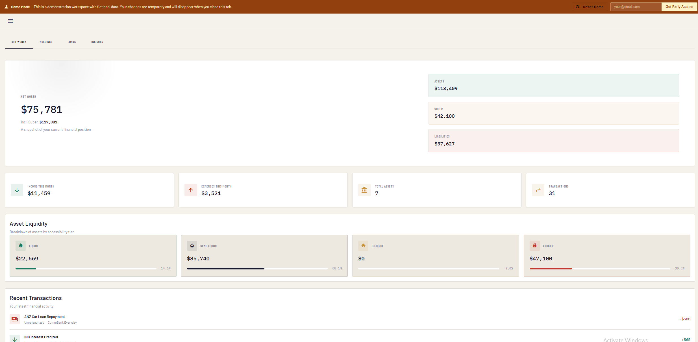
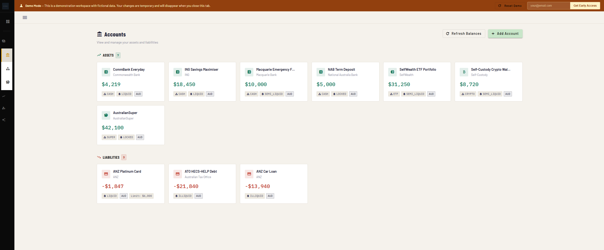
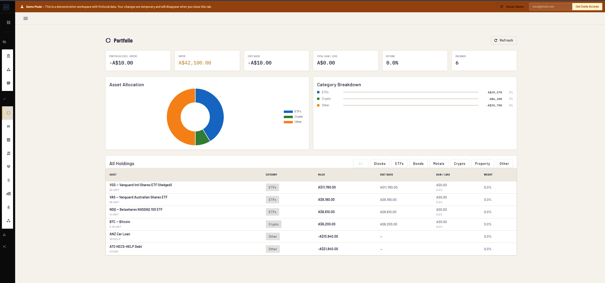
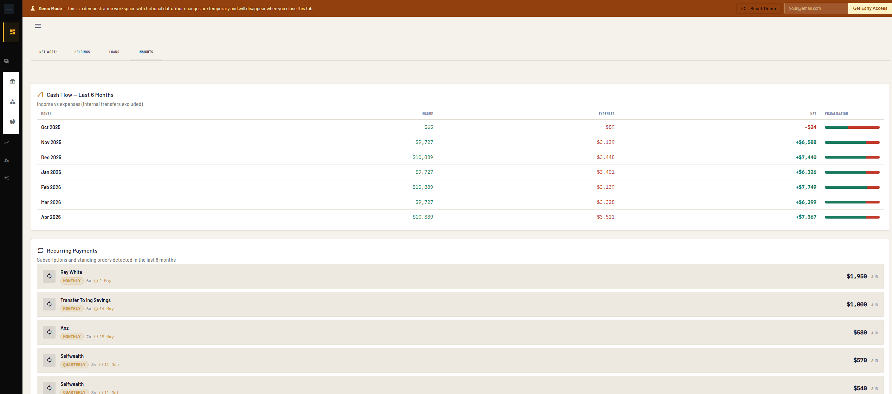

# CtrlValue — Personal Finance & Wealth Platform

A self-hosted personal finance platform for tracking accounts, transactions, investments, loans, budgets, and net worth across multiple workspaces. Built with Angular 19, ASP.NET Core 8, and PostgreSQL.


**[Try the live demo → demo.ctrlvalue.com](https://demo.ctrlvalue.com)**

---



<table>
  <tr>
    <td></td>
    <td></td>
  </tr>
  <tr>
    <td></td>
    <td></td>
  </tr>
</table>

---

## Features

- **Accounts & Transactions** — track balances, categorise transactions, import via CSV/OFX/QIF
- **Investments** — positions, price history, valuations (Alpha Vantage, Yahoo Finance, CoinGecko, metals)
- **Loans** — amortisation schedules, rate history, repayment tracking
- **Budgets** — monthly budget envelopes with actuals vs. targets
- **Net Worth Dashboard** — charts across all assets and liabilities
- **Multi-workspace** — multiple financial profiles under one account (household, business, SMSF, etc.)
- **AI Agent** — finance assistant powered by OpenAI or Anthropic (optional)
- **Manual Bank Connections** — link bank accounts manually or via CSV import
- **Account Security** — account lockout protection after failed login attempts
- **Audit Log** — full record of all changes and auth events

---

## Tech Stack

| Layer | Technology |
|-------|-----------|
| Frontend | Angular 19, Angular Material, Chart.js |
| Backend | ASP.NET Core 8, C# 12, Clean Architecture |
| Database | PostgreSQL 16, Entity Framework Core 8 |
| Auth | Custom JWT — httpOnly cookies, httpOnly refresh tokens |
| Container | Docker + nginx |
| Local Email | Mailpit |

---

## Quick Start (Docker)

The fastest way to run CtrlValue locally.

### Prerequisites

- [Docker Desktop](https://www.docker.com/products/docker-desktop/) (or Docker Engine + Compose plugin)

### 1. Clone the repo

```bash
git clone https://github.com/your-username/ctrlvalue.git
cd ctrlvalue
```

### 2. Configure environment

```bash
cp .env.example .env
```

Open `.env` and set the required values:

```env
# Required
DB_PASSWORD=your_strong_database_password
JWT_SECRET=your_random_string_at_least_32_characters
ENCRYPTION_KEY=your_base64_32_byte_key   # openssl rand -base64 32
```

### 3. Start all services

```bash
docker compose up --build
```

This builds and starts:

| Service | URL |
|---------|-----|
| Frontend (Angular) | http://localhost |
| Backend API | http://localhost:5000 |
| Mailpit (email UI) | http://localhost:8025 |
| PostgreSQL | localhost:5432 |

Database migrations run automatically on first boot.

### 4. Register an account

Open http://localhost, register, and verify your email via the Mailpit UI at http://localhost:8025.

### Stopping

```bash
docker compose down          # stop containers, keep database
docker compose down -v       # stop containers and delete database volume
```

---

## Local Development Setup

For contributing or running the services individually.

### Prerequisites

- [.NET 8 SDK](https://dotnet.microsoft.com/download/dotnet/8.0)
- [Node.js 20+](https://nodejs.org/) and npm
- [Angular CLI](https://angular.dev/) — `npm install -g @angular/cli`
- [dotnet-ef](https://learn.microsoft.com/en-us/ef/core/cli/dotnet) — `dotnet tool install --global dotnet-ef`
- PostgreSQL 16 (or `docker compose up postgres mailpit -d` to start just the DB and email)

### 1. Start supporting services

```bash
docker compose up postgres mailpit -d
```

### 2. Configure the backend

`appsettings.Development.json` is git-ignored. Create it at `backend/src/CtrlValue.Api/appsettings.Development.json`:

```json
{
  "ConnectionStrings": {
    "DefaultConnection": "Host=localhost;Database=ctrlvalue;Username=ctrlvalue;Password=your_db_password"
  },
  "Jwt": {
    "Secret": "a-local-dev-secret-at-least-32-characters-long",
    "Issuer": "CtrlValue.Api",
    "Audience": "CtrlValue.Client",
    "ExpiryMinutes": 60
  },
  "Encryption": {
    "Key": "REPLACE_WITH_BASE64_AES256_KEY_RUN_openssl_rand_base64_32"
  },
  "Email": {
    "SmtpHost": "localhost",
    "SmtpPort": 1025,
    "FromAddress": "noreply@ctrlvalue.local",
    "FromName": "CtrlValue",
    "FrontendBaseUrl": "http://localhost:4200"
  }
}
```

> Generate a fresh encryption key with: `openssl rand -base64 32`

### 3. Run the backend

```bash
cd backend
dotnet restore
dotnet run --project src/CtrlValue.Api
```

API: `https://localhost:5001` — Swagger: `https://localhost:5001/swagger`

Migrations run automatically on startup.

### 4. Run the frontend

```bash
cd frontend/ctrlvalue
npm install
ng serve
```

App: `http://localhost:4200`

The dev server proxies `/api` to `https://localhost:5001` via [`proxy.conf.json`](frontend/ctrlvalue/src/proxy.conf.json).

---

## Architecture

Clean Architecture — outer layers depend on inner layers, never the reverse.

```
┌──────────────────────────────────────────────────────┐
│  CtrlValue.Api           Controllers, middleware, DI  │
├──────────────────────────────────────────────────────┤
│  CtrlValue.Application   Services, interfaces, DTOs   │
├──────────────────────────────────────────────────────┤
│  CtrlValue.Infrastructure  EF Core, repositories      │
├──────────────────────────────────────────────────────┤
│  CtrlValue.Domain        Entities, enums, permissions │
└──────────────────────────────────────────────────────┘
```

```
Browser  ──/api──►  ASP.NET Core API  ──EF Core──►  PostgreSQL
                          │
                     nginx (Docker)
                     proxies /api/*
```

---

## Project Structure

```
├── backend/
│   ├── Dockerfile
│   └── src/
│       ├── CtrlValue.Api/             # Controllers, Program.cs, middleware
│       ├── CtrlValue.Application/     # Services, interfaces, DTOs
│       ├── CtrlValue.Domain/          # Entities, enums, permissions
│       └── CtrlValue.Infrastructure/  # EF Core, migrations, repositories
│
├── frontend/ctrlvalue/
│   ├── Dockerfile
│   ├── nginx.conf
│   └── src/app/
│       ├── pages/                    # Feature pages (one folder per route)
│       ├── services/                 # Angular services + api.generated.ts
│       ├── guards/                   # Auth and role guards
│       └── interceptors/             # JWT cookie interceptor
│
├── docker-compose.yml
├── .env.example
└── LICENSE
```

---

## Configuration Reference

### Required

| Variable | Description |
|----------|-------------|
| `DB_PASSWORD` | PostgreSQL password |
| `JWT_SECRET` | HS256 signing key — minimum 32 characters |
| `ENCRYPTION_KEY` | AES-256 key — base64-encoded 32 bytes (`openssl rand -base64 32`) |

### Optional

| Variable | Default | Description |
|----------|---------|-------------|
| `DB_USER` | `ctrlvalue` | PostgreSQL username |
| `JWT_ISSUER` | `ctrlvalue` | JWT issuer claim |
| `JWT_AUDIENCE` | `ctrlvalue` | JWT audience claim |
| `FRONTEND_URL` | `http://localhost` | Used in email links and CORS |
| `OPENAI_API_KEY` | _(blank)_ | Enables AI agent (OpenAI) |
| `ANTHROPIC_API_KEY` | _(blank)_ | Enables AI agent (Anthropic) |
| `KEY_VAULT_URI` | _(blank)_ | Azure Key Vault URI — skip for self-hosted |

---

## Database Migrations

```bash
# Apply all pending migrations
cd backend
dotnet ef database update --project src/CtrlValue.Infrastructure --startup-project src/CtrlValue.Api

# Create a new migration after changing entities
dotnet ef migrations add MigrationName --project src/CtrlValue.Infrastructure --startup-project src/CtrlValue.Api
```

---

## Refreshing the API Client

The Angular API client (`api.generated.ts`) is auto-generated from the backend's Swagger spec via NSwag. Run this after changing any backend API contracts (backend must be running):

```bash
cd frontend/ctrlvalue
npm run refresh-api-dev
```

> Do not edit `api.generated.ts` by hand — it is fully overwritten on each run.

---

## Running Tests

```bash
# Backend
cd backend
dotnet test

# Frontend
cd frontend/ctrlvalue
ng test --watch=false
```

---

## Contributing

1. Fork the repository
2. Create a feature branch: `git checkout -b feat/your-feature`
3. Follow the existing patterns — Clean Architecture on the backend, standalone Angular components on the frontend
4. Write tests for new behaviour (see [`CLAUDE.md`](CLAUDE.md) for testing conventions)
5. Open a pull request

---

## License

CtrlValue is licensed under the [Business Source License 1.1](LICENSE).

- **Free** for personal use, internal company use, and private self-hosting
- **Commercial use** (SaaS, managed hosting, embedding into a paid product) requires a separate license — contact [heytheresaik@gmail.com](mailto:heytheresaik@gmail.com)
- On **2032-04-21** the license converts to GPL v2 (fully open source)
